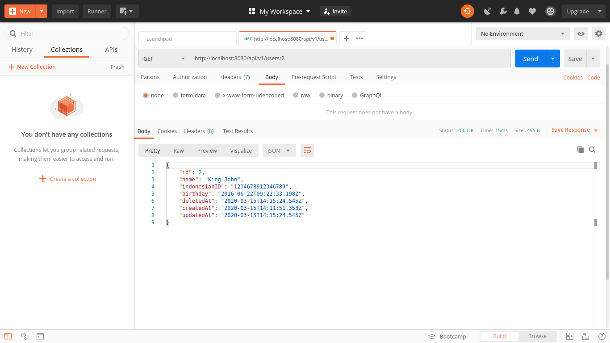

# MTG-Intern-Test
## CRUD Endpoints for RESTful APIs

### 1. Backend: Express, Objectionjs, Jest, Supertest, Knex and swagger-ui-express + JSDoc (documentation)

### 2. Database: Postgres

### 3. Model Specification
* User Model
    - Name: String Required
    - IndonesianID: String Required
    - Birthday: DateTime Required
    - Timestamps: createdAt, deletedAt, updatedAt

### 4. Route
* GET /api/v1/users : list all user
* GET /api/v1/users/:id : get a user with an id
* POST /api/v1/users : create a new user, with validation name (no contain number), id (must valid ktp)
* PUT /api/v1/users/:id : create a user with an id if not exist and update if already exist. Must insert all attributes.
* PATCH /api/v1/users/:id : partial update a user with an id, can name only or other attributes only.
* DELETE /api/v1/users/:id : softdelte a user with an id (by adding timestamp deletedAt)

### 5. Documentation
* GET /documentation/v1 : present Swagger data documentation

* Postman API
  - POST /api/v1/users

  - PUT /api/v1/users/:id

  - PATCH /api/v1/users/:id

  - GET /api/v1/users

  - DELETE /api/v1/users/:id

  - GET /api/v1/users/:id
